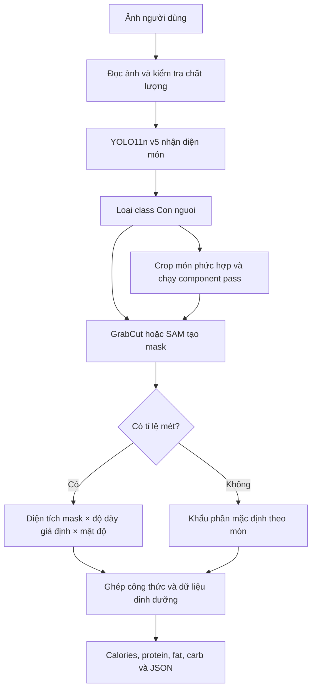

# Báo cáo vận hành model CalcuCalo ngày 30/09/2026

Ngày chốt trạng thái: **30/09/2026**  
Phiên bản mã nguồn: **0.5.1**  
Trạng thái chung: **detector candidate, chưa production-ready cho calories**

## 1. Model giao diện đang sử dụng

Trong trạng thái thư mục và biến môi trường hiện tại, giao diện tự động chọn:

```text
D:\Model\CalcuCalo\vietfood67_yolo11n_v5_ft_from_v4_5e\weights\best.pt
```

Đây là **`best.pt` của v5**, được fine-tune thêm 5 epoch từ checkpoint v4. Nguồn lựa chọn là
`auto_discovered`, không phải đường dẫn được khóa bằng biến môi trường.

Thứ tự tìm model của API hiện tại:

1. `CALCUCALO_MODEL` nếu biến môi trường này được đặt;
2. `models/best.onnx`;
3. `models/best.pt`;
4. `best.onnx` hoặc `best.pt` ở thư mục gốc dự án;
5. checkpoint `*/weights/best.*` có thời gian sửa đổi mới nhất.

V5 đang được chọn vì không có model ở các vị trí ưu tiên cao hơn và `best.pt` của v5 là
checkpoint phù hợp mới nhất được tìm thấy.

> Lưu ý: analyzer được cache trong tiến trình API. Nếu giao diện đã chạy từ trước khi thêm v5,
> hãy dừng và khởi động lại `uvicorn`. Endpoint `/api/v1/model/info` mới là nguồn xác nhận model
> thật sự đã được nạp trong tiến trình đang chạy.

Để tránh tự động nạp nhầm checkpoint khi có run mới, nên khóa model trước khi mở giao diện:

```powershell
$env:CALCUCALO_MODEL = "D:\Model\CalcuCalo\vietfood67_yolo11n_v5_ft_from_v4_5e\weights\best.pt"
uvicorn calcucalo.api:app --host 127.0.0.1 --port 8000
```

Sau đó kiểm tra:

```text
http://127.0.0.1:8000/api/v1/model/info
```

## 2. Các khối đang được sử dụng

| Khối | Công nghệ/dữ liệu hiện tại | Vai trò |
|---|---|---|
| Nhận diện món | YOLO11n detect, v5 `best.pt`, 68 lớp | Tìm món, nhãn, bounding box và confidence |
| Dataset detector | VietFood67/VietFood68, 100% tập train | Huấn luyện nhận diện món Việt |
| Lọc kết quả | Bỏ class ID 27 `Con nguoi` khỏi phân tích dinh dưỡng | Không trả người như một món ăn |
| Kiểm tra ảnh | OpenCV, heuristic blur/độ sáng/độ phân giải | Cảnh báo ảnh mờ, tối, quá nhỏ |
| Tách vùng món | GrabCut mặc định; SAM/SAM2 là tùy chọn | Sinh mask từ bounding box khi YOLO detect không có mask |
| Component pass | Chạy lại detector trong crop món ở 960 px | Tìm thành phần nhìn thấy có nhãn tương thích công thức |
| Ước lượng tỉ lệ | `cm_per_pixel` hoặc đường kính đĩa/bát | Đổi pixel sang centimet nếu có vật chuẩn |
| Ước lượng khối lượng | Diện tích mask × độ dày giả định × khối lượng riêng; nếu không có tỉ lệ thì dùng khẩu phần mặc định | Trả gram và khoảng bất định |
| Công thức món | `configs/food_catalog.json` | Ghép món với component, calories và macro/100 g |
| Portion prior | `configs/portion_priors.yaml` | Độ dày, mật độ, khẩu phần và bất định mặc định |
| API/giao diện | FastAPI + giao diện web | Nhận ảnh, cấu hình vật chuẩn và trả JSON/kết quả trực quan |

`food_catalog.json` tự đánh dấu chất lượng là
`seed_estimate_requires_dietitian_validation`: số liệu hiện tại là dữ liệu khởi tạo phục vụ phát
triển, chưa phải bảng dinh dưỡng đã được chuyên gia kiểm định.

## 3. Luồng vận hành hiện tại



Chi tiết:

1. Ảnh được đọc, sửa hướng EXIF và chuẩn hóa RGB.
2. Bộ kiểm tra chất lượng phát hiện ảnh mờ, tối/sáng quá mức hoặc độ phân giải thấp. Khối này chỉ
   cảnh báo; nó không khôi phục được góc chụp hay phần thức ăn bị che.
3. YOLO11n v5 dự đoán món với ngưỡng mặc định `confidence=0.38`, `IoU=0.60`, `imgsz=640`.
4. Với món phức hợp, hệ thống crop vùng món và chạy detector lần hai với
   `confidence=0.15`, `IoU=0.50`, `imgsz=960`, tối đa 12 instance.
5. Component nhìn thấy được ghép theo nhãn/alias trong công thức. Thành phần không nhìn thấy vẫn
   được suy ra từ công thức mẫu. Các nguồn được ghi rõ là `visual_match`,
   `visual_metric_estimate`, `catalog_prior` hoặc `user_override`.
6. GrabCut tạo mask mặc định. SAM/SAM2 chỉ được dùng khi người vận hành cấu hình
   `CALCUCALO_SEGMENTER=sam` và cung cấp checkpoint tương ứng.
7. Nếu ảnh có tỉ lệ mét, diện tích mask được quy đổi sang cm². Khối lượng được tính bằng độ dày và
   mật độ giả định theo lớp; **chiều sâu không được đo trực tiếp**.
8. Nếu không có vật chuẩn, model dùng khẩu phần mặc định/công thức mẫu thay vì đo gram từ ảnh.
9. Calories và macro của mỗi component được tính theo `giá trị/100 g × gram/100`, sau đó cộng thành
   tổng món.
10. API trả được JSON đầy đủ gồm bbox, polygon, cách tính, giả định, cảnh báo và dinh dưỡng; chế độ
    compact chỉ trả contract dinh dưỡng gọn cho ứng dụng.

## 4. Độ tin cậy hiện tại

### 4.1. Nhận diện món

Kết quả validation lưu trong run v5:

| Chỉ số | Giá trị | Cách hiểu |
|---|---:|---|
| Precision | **0,78613 (78,61%)** | Trong các box model dự đoán, khoảng 78,61% là đúng theo điều kiện đánh giá validation |
| Recall | **0,70297 (70,30%)** | Model tìm được khoảng 70,30% đối tượng được gán nhãn trong validation |
| mAP50 | **0,77935 (77,94%)** | AP trung bình tại IoU 0,50 |
| mAP50–95 | **0,62579 (62,58%)** | AP trung bình nghiêm ngặt hơn trên IoU 0,50–0,95 |
| F1 tốt nhất | **xấp xỉ 0,74 tại confidence 0,384** | Cơ sở đổi ngưỡng món chính mặc định thành 0,38 |

Đánh giá: khâu nhận diện món ở mức **khá trên validation của VietFood67** và đủ làm detector
candidate. Các số trên không phải xác suất một kết quả calories là đúng, cũng chưa chứng minh khả
năng tổng quát trên ảnh điện thoại ngoài dataset.

### 4.2. Tách thành phần

Mức tin cậy: **thấp đến trung bình, chưa định lượng được bằng phần trăm**.

- Component pass hiện dùng chính detector món v5, không phải model component chuyên biệt.
- Hệ thống nhận ra được một số thành phần có nhãn trùng/tương thích lớp món, nhưng VietFood67
  không có ground truth đầy đủ cho từng nguyên liệu nhỏ và thành phần ẩn.
- Chưa có precision/recall component-level. Vì vậy không được hiểu một component trong công thức
  là model đã thật sự nhìn thấy nó; cần đọc trường `basis`.

### 4.3. Mask và khối lượng

Mức tin cậy: **thấp nếu không có vật chuẩn; trung bình-thấp nếu có tỉ lệ mét tốt**.

- GrabCut là phép tách nền heuristic, chưa có metric mask IoU trên tập test chuyên biệt.
- Không có `cm_per_pixel` hoặc đường kính đĩa: model dùng prior khẩu phần. Prior mặc định có bất
  định tương đối 50%, sau đó còn cộng phạt do mask kém.
- Có tỉ lệ mét: diện tích được đo tốt hơn, nhưng độ dày vẫn là giả định. Bất định hình học mặc định
  là 30%, cộng thêm bất định calibration và mask.
- Trường `portion.confidence` và khoảng gram là điểm heuristic nội bộ, **không phải xác suất đã
  hiệu chuẩn bằng cân thực tế**.

### 4.4. Calories và dinh dưỡng

Mức tin cậy: **chưa đủ để công bố một tỷ lệ chính xác end-to-end**.

Hiện chưa có tập ảnh độc lập chứa đồng thời:

- món và component đúng;
- khối lượng từng component được cân;
- calories/protein/fat/carb tham chiếu;
- nhiều góc chụp và điều kiện ánh sáng thực tế.

Do đó chưa thể nói “calories chính xác 78%”. Con số 78,61% là precision của **detector box**, không
phải độ chính xác calories. Sai số calories còn tích lũy từ nhận diện món, component bị che, mask,
tỉ lệ kích thước, độ dày, mật độ, gram và dữ liệu dinh dưỡng.

### 4.5. Kết luận độ tin cậy theo tác vụ

| Tác vụ | Mức hiện tại | Có số đo độc lập? |
|---|---|---|
| Nhận diện món trên validation VietFood67 | Khá | Có: P/R/mAP validation |
| Nhận diện trên ảnh điện thoại thực tế | Chưa xác minh đầy đủ | Chưa |
| Tách component nhỏ | Thấp–trung bình | Chưa có metric component-level |
| Mask chính xác | Thấp–trung bình | Chưa có mask IoU test |
| Gram không có vật chuẩn | Thấp | Chưa có MAE/MAPE cân thực tế |
| Gram có vật chuẩn | Trung bình-thấp | Chưa có MAE/MAPE; chiều sâu vẫn giả định |
| Calories và macro end-to-end | Thấp cho quyết định y tế/dinh dưỡng chính xác | Chưa có MAE/MAPE calories |

Trạng thái API vì vậy là:

```json
{
  "detector_candidate": true,
  "production_ready": false
}
```

## 5. Những artifact đã có và còn thiếu

V5 hiện có `best.pt`, `last.pt`, checkpoint từng epoch, `results.csv`, `results.png`, đường cong
P/R/PR/F1, confusion matrix và ảnh dự đoán validation.

Còn thiếu:

- báo cáo `split=test` độc lập và `test_metrics.json`;
- `best.onnx` để triển khai ONNX;
- benchmark ảnh điện thoại ngoài dataset;
- dataset component-level;
- ảnh có cân gram và dinh dưỡng chuẩn để đo MAE/MAPE end-to-end.

Không cần train lại để tạo test report và ONNX; có thể chạy `scripts/evaluate_detector.py` với
checkpoint v5 hiện tại.

## 6. Cách sử dụng kết quả an toàn

- Tin vào nhãn món nhiều hơn khi detection confidence cao và ảnh đạt chất lượng tốt, nhưng vẫn cho
  người dùng sửa nhãn.
- Ưu tiên yêu cầu người dùng nhập đường kính đĩa hoặc `cm_per_pixel`; nếu không có, phải hiển thị
  rõ “khẩu phần ước lượng”.
- Hiển thị khoảng gram/calories và các cảnh báo, không chỉ một số tuyệt đối.
- Hiển thị `basis` của từng component để phân biệt thành phần nhìn thấy với thành phần suy ra từ
  công thức.
- Không dùng kết quả hiện tại để kê khẩu phần y tế, điều trị hoặc quyết định dinh dưỡng cần độ
  chính xác cao.

## 7. Việc cần làm tiếp theo

1. Chạy v5 trên `split=test` và lưu `test_metrics.json`, confusion matrix và AP từng lớp.
2. Chạy bộ ảnh điện thoại thật, gồm góc nghiêng, ánh sáng xấu, món nước và món nhiều component.
3. Gắn nhãn component riêng hoặc huấn luyện detector/segmenter component chuyên biệt.
4. Thu ảnh có vật chuẩn và cân từng component để đo MAE gram, MAPE gram và MAPE calories.
5. Thay dữ liệu dinh dưỡng khởi tạo bằng nguồn Việt Nam đã kiểm chứng và công thức được cân.
6. Chỉ nâng `production_ready=true` sau khi detector, component, portion và nutrition đều đạt tiêu
   chí trên tập test độc lập.

## 8. Kết luận

Giao diện hiện dựa trên **v5 `best.pt`**, không phải v3 hay v4. V5 là checkpoint nhận diện món tốt
nhất hiện có về precision và mAP validation, nhưng toàn bộ hệ thống calories vẫn là baseline có
giải thích và cảnh báo. Có thể dùng để demo, kiểm thử luồng, thu thập dữ liệu và cho người dùng sửa
kết quả; chưa nên xem số calories là phép đo chính xác đã được kiểm định.
